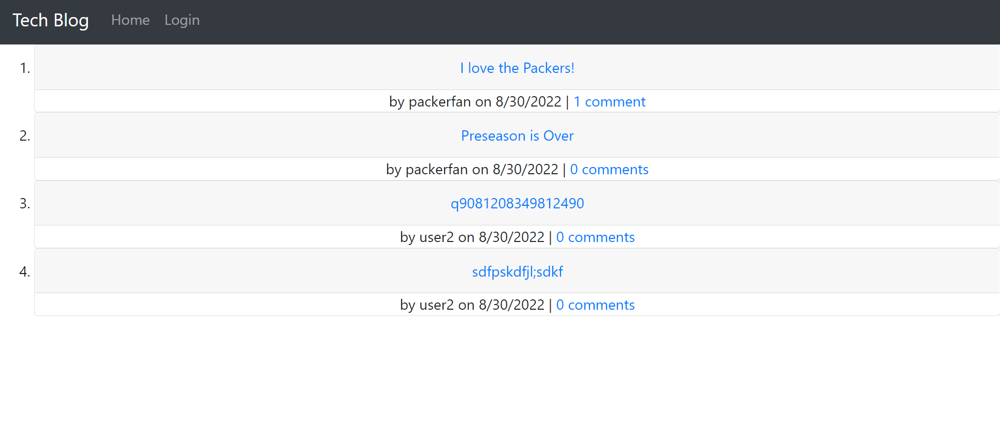
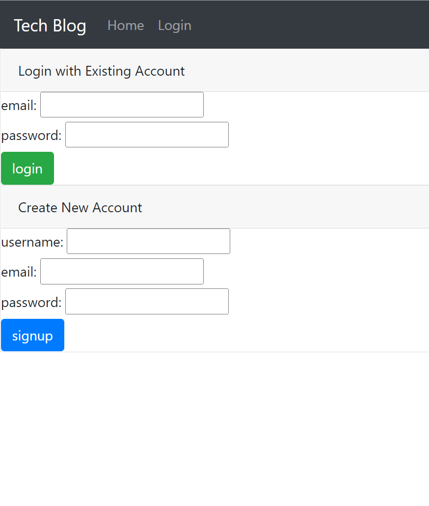
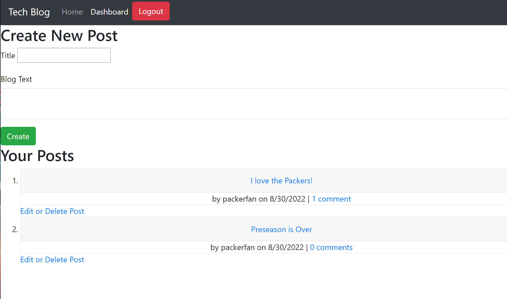

# Tech-Blog

## Description
Tech-Blog is a full-stack application that enables users to make blog posts, read other users' blog posts, and comment on posts. With the ability to login to the website, users' posts are saved and accessible from any browser or device. On the homepage of the site, the user will see a list of the recent blog posts as well as the navigation bar at the top of the screen. Once logged in, the user will have access to the dashboard where they can make new posts, edit/delete their existing posts, or comment on other users' posts.

## Installation
The application is live and deployed using Heroku. There is no additional installation required.

## Usage
When you navigate to the website, you can jump right in to reading posts. If you'd like to add comments or your own blog posts you will click the login button in the navigation bar. On the login screen, you'll be prompted to either login to an existing account or create a new account. When you've created your account or logged in, you'll be redirected to your dashboard where you can see your previous posts or create a new post. Under each post is an option to edit or delete the post. If you'd like to comment on other posts, you can navigate back to the homepage by clicking the "home" button or the Tech-Blog name. When you click on the post you'll see a comment form with a text box and a submit button. Comments and posts will display the username of the person who made the post and the date it was created.
 
 
[Deployed Website](https://protected-sea-60494.herokuapp.com/)
 
 

 

 

